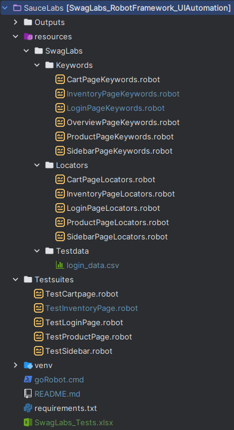
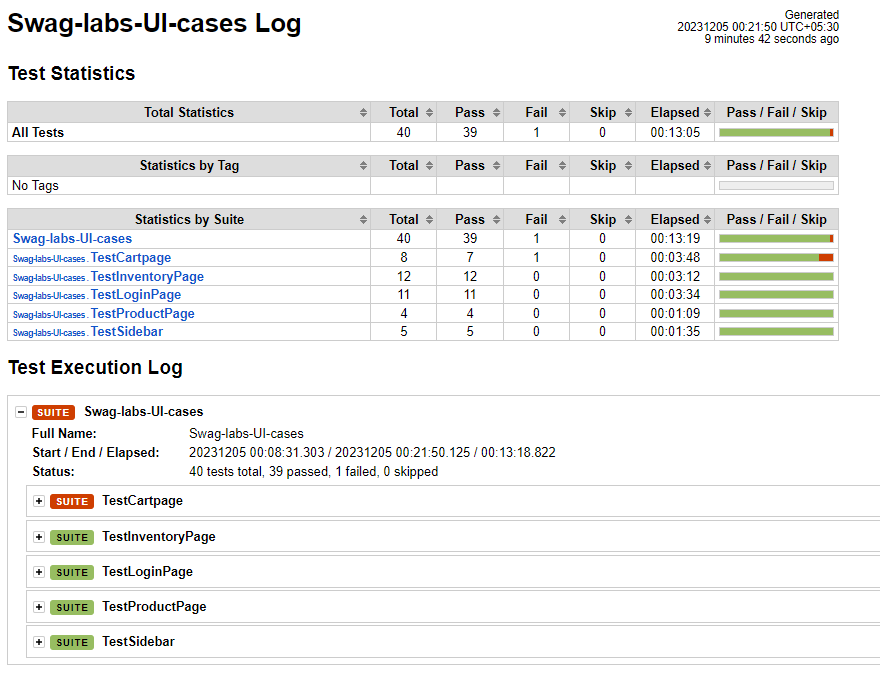

# SwagLabs_RobotFramework_UIAutomation
# [-] Folder structure :

#### [-] Each page has its own respective test suite for the most part and corresponding to each there is also Keyword and Locator resource files. 

#### [-] SwagLabs_Tests.xlsx  file contains all the tests for the suites with respective test steps and other information

#### [-] Install the requirements using requirements.txt 

#### [-] Run all the rest cases by running  "goRobot.cmd" in cmd  or running respective robot command, i.e 
robot   -d .\Outputs\   .\Testsuites\*
(Reports will be generated in the Outputs folder)

#### [-] To run a specific suite replace .\Testsuites\* to .\Testsuites\{{Suitename}}
(where {{Suitename}}== suite you want to run tests for)

#### [-] Screenshot of the cumulated report for all the suites:

    
